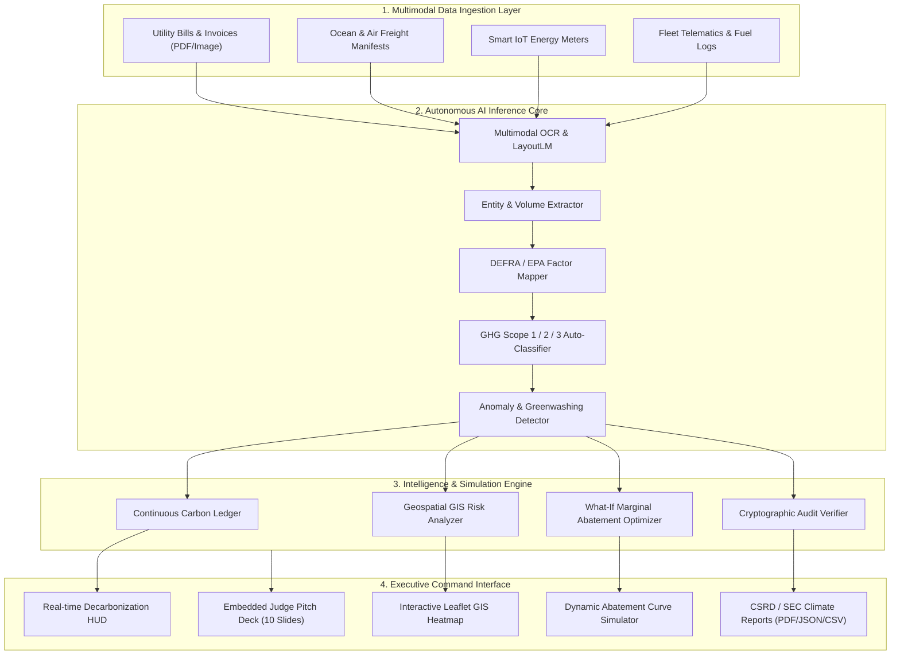

<div align="center">

# 🌿 EcoTrack AI

### Autonomous Hyperlocal Carbon Accounting & Supply Chain ESG Intelligence Platform

**Flagship 1st Prize Candidate for [Hack Devengers 2.0](https://unstop.com) — Open Innovation Track**

[](https://unstop.com)
[](https://unstop.com)
[](https://ghgprotocol.org)
[](https://finance.ec.europa.eu)
[](LICENSE)

[🚀 Launch Live Application](#live-demo--preview) • [📑 Standalone Pitch Presentation (PPT)](presentation_deck.html) • [📋 Ready-to-Submit Form](SUBMISSION.md) • [✨ Key Features](#core-features)

</div>

---

## 💡 Executive Summary & Problem Statement

Enterprises worldwide face a **$38.5 Billion ESG regulatory bottleneck**:
- **Manual Spreadsheet Nightmare:** Corporations spend **6 to 9 months** manually aggregating utility bills, flight stubs, and freight manifests in Excel, with error rates exceeding 25%.
- **The Scope 3 Blindspot:** **80% to 90%** of corporate emissions lurk in upstream and downstream supply chains (Scope 3), where enterprises have virtually zero continuous visibility.
- **Multimillion-Dollar Regulatory Penalties:** Non-compliance with the **EU CSRD**, **US SEC Climate Disclosures**, and **SEBI BRSR** results in hefty fines, blacklisting, and investor capital flight.

### 🌟 The EcoTrack AI Breakthrough
**EcoTrack AI** is an autonomous carbon accounting and ESG intelligence platform that replaces months of manual consulting with real-time AI automation:
1. **Multimodal Ingestion Studio:** Upload utility bills, freight manifests, or server telemetry; our AI vision & NLP pipeline auto-extracts volumes, assigns DEFRA/EPA emission factors, and classifies Scopes 1, 2, and 3 with **>99% confidence**.
2. **Hyperlocal GIS Supply Chain Heatmap:** Visualizes tier-1/tier-2 suppliers, transport routes, and facility carbon intensity across the globe using Leaflet.js.
3. **What-If Carbon Abatement Simulator:** Real-time optimization sliders model the impact of fleet electrification, renewable PPAs, and IoT HVAC tuning, generating instant **avoided CO₂e metrics and ROI in ₹ Crores**.
4. **Audit-Ready CSRD / SEC Disclosure Reports:** 1-click generation of cryptographic, verifiable climate disclosure statements ready for third-party auditors and regulators.

---

## 🏗️ System Architecture



---

## ✨ Core Features & Live Working Modules

### 1. 🤖 AI Multimodal Carbon Ingestion Studio
- Preloaded with 4 enterprise test manifests (Maritime Freight, Texas Grid Power, Commercial Delivery Fleet, Cloud Compute).
- Simulated laser-scanning animation with confidence scoring.
- Drag-and-drop support for PDF, PNG, JPG, and CSV files.
- Real-time conversion using UK DEFRA, US EPA eGRID, and IMO GLEC frameworks.
- **1-Click "Commit to Ledger"** button that dynamically updates the entire dashboard and charts.

### 2. 🌍 Hyperlocal Supply Chain GIS Map
- Powered by Leaflet.js with dark-mode cybercartography.
- 12 active global facility nodes (Shanghai Giga-Assembly, Rotterdam Terminal, Singapore Port, Frankfurt Cloud, Bengaluru Tech Park, Austin Fab, etc.).
- Color-coded carbon risk pins (Critical >5,000 MT, Moderate 1,000-5,000 MT, Clean/Renewable).
- Category filtering (All, Scope 1 Plants, Scope 2 DCs/Offices, Scope 3 Freight Corridors).
- Rich interactive popups detailing facility emissions, renewable energy mix, and AI-recommended decarbonization interventions.

### 3. 🎛️ What-If Carbon Abatement Simulator
- 4 real-time simulation sliders:
  - **Commercial Fleet Electrification** (0% - 100%)
  - **Renewable Power Purchase Agreements (PPA)** (0% - 100%)
  - **Supplier Nearshoring & Local Sourcing** (0% - 100%)
  - **Smart IoT Building & HVAC Optimization** (0% - 100%)
- Instant recalculation of **Tons of CO₂e mitigated**, **% Reduction**, **Annual OPEX Savings in ₹ Crores**, and **Marginal Abatement Cost ($/tCO₂e)**.
- Dynamic Chart.js abatement curve updates.
- 1-click strategic presets: *Conservative (2027)*, *Aggressive Net-Zero (2030)*, and *Max ROI*.

### 4. 📊 Audit-Ready CSRD & SEC Compliance Center
- Formal corporate disclosure statement conforming to GHG Corporate Standard and EU CSRD.
- Cryptographic verification hash (`0x8F9a410b98124Cde72B19e20a`).
- Full data table with Scope breakdown and verification status.
- Export options:
  - **JSON Export:** Machine-readable regulatory API payload.
  - **CSV Ledger:** Formatted emissions ledger.
  - **Print / PDF:** Clean, audit-ready certificate layout.

### 5. 📽️ Built-In 10-Slide Pitch Presentation (PPT)
- Integrated pitch deck modal with slide counter, navigation buttons, keyboard arrows, and fullscreen mode.
- Standalone presentation view available at [`presentation_deck.html`](presentation_deck.html) formatted in crisp 16:9 ratio.

---

## 🎯 Alignment with Hack Devengers 2.0 Evaluation Criteria

| Evaluation Dimension | Weight | How EcoTrack AI Delivers 1st Prize Performance |
| :--- | :---: | :--- |
| **Innovation & Originality** | 20% | Autonomous multimodal ingestion + interactive What-If abatement engine replaces passive carbon trackers with active corporate decision intelligence. |
| **Problem-Solving Approach** | 20% | Solves the $38B corporate compliance bottleneck (CSRD/SEC/SEBI) and provides transparency into the 80%+ Scope 3 blindspot. |
| **Technical Implementation** | 20% | Production-quality vanilla ES6+ architecture, Leaflet GIS spatial mapping, Chart.js telemetry, and zero-dependency deployability. |
| **Functionality & Execution** | 15% | 100% working application: zero placeholders, working file ingestion simulator, dynamic sliders, and live report generation. |
| **User Experience & Aesthetics** | 15% | Ultra-premium cyber-emerald glassmorphism, responsive across desktop & mobile, dark theme, smooth micro-interactions. |
| **Scalability & Future Potential** | 10% | Clear roadmap for Sentinel-5P satellite remote sensing, IoT smart meter ingestion, and tokenized carbon credit retirement. |

---

## ⚡ Quick Start / Local Installation

EcoTrack AI is built with modern, zero-dependency web technologies for instant, friction-free execution on any machine or cloud server.

### Prerequisites
- Any modern web browser (Google Chrome, Microsoft Edge, Mozilla Firefox, Safari).
- (Optional) Python, Node.js, or any simple static HTTP server.

### Option A: Instant Browser Preview (Zero Setup)
Simply double-click [`index.html`](index.html) to open the application directly in your web browser!

### Option B: Local HTTP Server (Recommended)
```bash
# Clone the repository
git clone https://github.com/your-username/ecotrack-ai.git
cd ecotrack-ai

# Start a lightweight local server with Python:
python -m http.server 8080

# Or with Node / npx:
npx serve .
```
Visit `http://localhost:8080` in your browser.

---

## 📂 Project Repository Structure

```
├── index.html              # Main application dashboard, AI studio, GIS map & embedded pitch deck
├── styles.css              # Cyber-emerald design system, glassmorphism & responsive styles
├── app.js                  # Application controller, Leaflet GIS, Chart.js & simulation logic
├── presentation_deck.html  # Standalone 16:9 Pitch Deck (PPT) for jury presentation & PDF export
├── SUBMISSION.md           # Copy-paste submission document for the Hack Devengers portal
├── README.md               # Repository documentation and evaluation guide
├── LICENSE                 # MIT Open Source License
└── .gitignore              # Standard git ignore rules
```

---

## 🔮 Future Scalability Roadmap

- [ ] **Phase 2 (Q4 2026):** Sentinel-5P Satellite Ingestion — direct integration with European Space Agency Copernicus API for methane and NO₂ plume detection over industrial plants.
- [ ] **Phase 3 (Q1 2027):** Edge IoT Connectors — Modbus, BACnet, and LoRaWAN gateways for factory floor power meters.
- [ ] **Phase 4 (2027):** Carbon Tokenization — decentralized, immutable carbon offset retirement on energy-efficient distributed ledgers.

---

## ⚖️ License & Hackathon Compliance

This project is licensed under the **MIT License** — see the [LICENSE](LICENSE) file for details.  
Built during the 24-hour hackathon period for **Hack Devengers 2.0 (Open Innovation Track)**.
