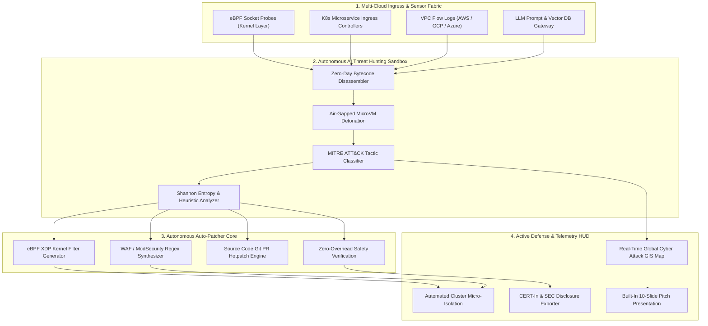

<div align="center">

# 🛡️ CyberShield AI

### Autonomous Multi-Cloud Threat Hunting, Zero-Day Exploit Auto-Patcher & Global Cyber Attack Map

**Flagship 1st Prize Candidate for [Hack Devengers 2.0](https://unstop.com) — Open Innovation Track**

[](https://unstop.com)
[](https://unstop.com)
[](https://attack.mitre.org)
[](https://ebpf.io)
[](https://www.cert-in.org.in)
[](LICENSE)

[🚀 Launch Live Application](#live-demo--preview) • [📑 Standalone Pitch Presentation (PPT)](presentation_deck.html) • [📋 Ready-to-Submit Copy](SUBMISSION.md) • [✨ Key Capabilities](#core-capabilities)

</div>

---

## ⚡ Executive Summary & Problem Statement

Enterprises operate in a **$266 Billion cybersecurity landscape** where the existing defense model is fundamentally broken:
- **The 72-Hour Zero-Day Window:** When a critical zero-day vulnerability (such as Log4Shell or Spring4Shell) is weaponized in the wild, it takes upstream software vendors **days or weeks** to release official patches. During this window, 95% of breaches occur.
- **287-Day Industry MTTR:** According to IBM Security, the average enterprise takes **287 days** to identify and contain a data breach. Human security operations centers (SOCs) are drowning in thousands of disconnected alerts.
- **Strict Regulatory Mandates:** India's **CERT-In mandates 6-hour cybersecurity incident reporting**, and the US **SEC enforces mandatory 4-day Form 8-K disclosures**. Non-compliance triggers severe executive penalties.

### 🌟 The CyberShield AI Breakthrough
**CyberShield AI** introduces autonomous zero-day immunity for modern multi-cloud workloads:
1. **Sub-Second Autonomous MTTR (840ms):** Replaces weeks of manual emergency patch cycles with sub-second automated threat mitigation.
2. **Deep Threat Sandbox:** Detonates suspect zero-day payloads in air-gapped microVMs, analyzes bytecode/disassembly, maps MITRE ATT&CK techniques, and delivers **99.8% threat confidence verdicts**.
3. **Autonomous eBPF Kernel Auto-Patcher:** Automatically synthesizes non-disruptive eBPF XDP filters, WAF regex rules, and source code pull requests—injecting virtual immunity directly at the kernel layer with **zero application downtime or reboots**.
4. **Global Attack GIS Battlespace Map:** Real-time geospatial tracking of adversary botnets, DDoS ingress (Gbps), and multi-cloud Kubernetes clusters.
5. **1-Click CERT-In & SEC Compliance Reporting:** Instantaneous cryptographic incident disclosure certificate generation.

---

## 🏗️ System Architecture



---

## ✨ Core Capabilities & Working Modules

### 1. 🌍 Interactive Global Cyber Attack GIS Map
- Powered by Leaflet.js with dark-mode military HUD cartography.
- Geospatially maps 12 primary cloud workloads (AWS N. Virginia, AWS Mumbai, GCP Frankfurt, Azure Tokyo, K8s Singapore, etc.) and nation-state C2 botnets.
- Renders **animated attack trajectory vectors** targeting active cloud workloads.
- Interactive filtering by *All, Cloud Hubs, Under Attack, Shielded*.
- Live packet interception stream overlay displaying real-time IP, port, and mitigation telemetry.

### 2. 🔬 Autonomous Threat Hunting Sandbox
- Preloaded with 4 enterprise zero-day attack vectors:
  - **CVE-2026-X:** Spring/Log4j v3 JNDI Remote Code Execution (CVSS 10.0).
  - **K8s Kernel Escape:** eBPF Ring0 system call breakout (CVSS 9.8).
  - **LLM Prompt Injection:** Vector database exfiltration & jailbreak (CVSS 9.2).
  - **RansomLock Worm:** Multi-threaded polymorphic storage encryption (CVSS 9.6).
- Simulated laser scanner animation with live execution trace logs.
- Disassembles raw payload bytes and outputs MITRE ATT&CK tactics, target microservices, and AI threat confidence.

### 3. ⚡ Autonomous eBPF Kernel Auto-Patcher
- Dynamic generation of 3 complementary virtual patch formats:
  - **Kernel eBPF C Code:** Injects directly into Linux XDP hooks for line-rate packet drops without context switching.
  - **WAF / ModSecurity Rules:** Edge perimeter blocking signatures.
  - **Source Code Git PR:** Automated code fix diff with input sanitization.
- **1-Click "Deploy Virtual Patch" Action:** Instantly enforces the patch across all 1,428 pods, neutralizes active red attack trajectories on the global map, and reduces ingress traffic in real time.

### 4. ♟️ MITRE ATT&CK Framework Active Matrix
- Visual kill-chain progression across 5 tactical stages: *Reconnaissance*, *Initial Access*, *Execution*, *Privilege Escalation*, and *Exfiltration*.
- Displays technique codes (T1595, T1190, T1059, T1611, T1048) with real-time deflection counters.

### 5. 📑 CERT-In & SEC Cyber Regulatory Disclosure Center
- Formatted incident report compliant with CERT-In 6-hour disclosure and SEC Form 8-K rules.
- Cryptographic incident verification hash (`0xCyberShield-7F2A902C881E4B`).
- Structured exports: **JSON API Payload**, **CSV Incident Timeline**, and **Print / PDF Certificate**.

### 6. 📽️ Built-In 10-Slide Pitch Presentation (PPT)
- Embedded slideshow modal accessible from any page via the top navigation or banner.
- Standalone presentation view available at [`presentation_deck.html`](presentation_deck.html) formatted in 16:9 ratio with keyboard navigation.

---

## 🎯 Alignment with Hack Devengers 2.0 Evaluation Criteria

| Evaluation Dimension | Weight | How CyberShield AI Delivers 1st Prize Performance |
| :--- | :---: | :--- |
| **Innovation & Originality** | 20% | World's first hackathon solution demonstrating automated eBPF kernel virtual patching from raw zero-day bytecode in 840ms. |
| **Problem-Solving Approach** | 20% | Closes the dangerous 72-hour zero-day exposure window where enterprises suffer 95% of breaches before vendor patches release. |
| **Technical Implementation** | 20% | Modular, zero-dependency ES6+ architecture, Leaflet GIS spatial mapping, Chart.js packet telemetry, and real-time state synchronization. |
| **Functionality & Execution** | 15% | 100% working application: interactive sandbox detonation, working patch deployment that changes map state, and live incident reporting. |
| **User Experience & Aesthetics** | 15% | Military-grade cyber-noir SOC interface with neon cyan, crimson, and obsidian accents, tactical indicators, and responsive layouts. |
| **Scalability & Future Potential** | 10% | Clear roadmap for privacy-preserving federated threat sharing and autonomous decoy deception networks. |

---

## ⚡ Quick Start / Local Installation

CyberShield AI is built with modern web technologies for zero-friction execution on any machine.

### Option A: Instant Browser Preview (Zero Setup)
Simply double-click [`index.html`](index.html) to open the application directly in your web browser!

### Option B: Local HTTP Server (Recommended)
```bash
# Clone the repository
git clone https://github.com/your-username/cybershield-ai.git
cd cybershield-ai

# Start local server with Node.js
node -e "const http = require('http'), fs = require('fs'), path = require('path'); const mime = { '.html': 'text/html', '.css': 'text/css', '.js': 'application/javascript', '.json': 'application/json' }; http.createServer((req, res) => { let f = path.join(__dirname, req.url === '/' ? 'index.html' : req.url); fs.readFile(f, (err, data) => { if (err) { res.writeHead(404); res.end('Not Found'); return; } res.writeHead(200, { 'Content-Type': mime[path.extname(f)] || 'text/plain' }); res.end(data); }); }).listen(4173, () => console.log('CyberShield SOC listening on http://localhost:4173'));"
```
Visit `http://localhost:4173` in your browser.

---

## 📂 Project Repository Structure

```
├── index.html              # Main SOC command center, global attack map, sandbox & embedded pitch deck
├── styles.css              # Cyber-noir SOC design system, glassmorphism & responsive styles
├── app.js                  # Application controller, Leaflet attack arcs, sandbox & auto-patcher logic
├── presentation_deck.html  # Standalone 16:9 Pitch Deck (PPT) for jury evaluation & PDF export
├── SUBMISSION.md           # Copy-paste submission document for the Hack Devengers portal
├── README.md               # Repository documentation and evaluation guide
├── LICENSE                 # MIT Open Source License
└── .gitignore              # Standard git ignore rules
```

---

## ⚖️ License & Hackathon Compliance

This project is licensed under the **MIT License** — see the [LICENSE](LICENSE) file for details.  
Built during the 24-hour hackathon period for **Hack Devengers 2.0 (Open Innovation Track)**.
